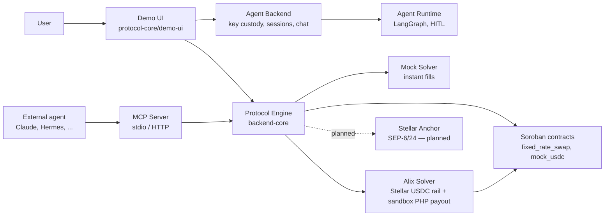

# Architecture

HumanFX is an agentic FX network: humans and AI agents on one side, partner
"solvers" providing fiat rails on the other, and a Protocol Engine brokering
quotes, intents, route agreements, mandates, and settlements between them.
On this branch the user-facing crypto network is **Stellar (testnet)**.



## Components

### Protocol Engine — `protocol-core/backend-core`

NestJS modular monolith (Postgres + Redis). The brain of the network:

- **Quote book** — partners push quote bands per corridor; agents browse and
  compare.
- **Intent → route agreement → settlement** — the payment lifecycle as
  first-class, auditable objects.
- **Mandates** — signed, scoped authority for agents (caps, allowlists,
  expiry, revocation).
- **Identity** — human KYC (Didit), verification badges, and **Stellar wallet
  linking** via a SIWE-style challenge/verify flow.
- **Recipients** — the registered address book that every payout is validated
  against.
- **Swap quotes** — XLM↔USDC quotes against the Soroban fixed-rate contract.
- No custody, no signing of value: the engine coordinates; wallets and solvers
  move funds.

Default port 3000. Runs with `backend-core/docker-compose.yml`
(Postgres 15 + Redis 7).

### Demo UI — `protocol-core/demo-ui`

Vite + React SPA. Google OAuth → HumanFX identity, KYC start, and a background
**demo agent** (in-browser ed25519 keypair) that acts on the user's behalf.
Flows: on-ramp, off-ramp, on-chain XLM↔USDC swap, open-mandate limit orders,
recipients book, and a live intent tracker (SSE).

### Agent Backend — `protocol-core/agent-backend`

Control plane for hosted agents: key custody, session brokering, usage
metering, and the chat relay between humans and their agents. Port 4000.

### Agent Runtime — `agentic-runtime`

LangGraph-based workflow engine behind the hosted chat experience:
conversation persistence, human-in-the-loop interrupts, structured action
endpoints, durable workflow events. Chat text is never treated as financial
authorization — mutations exit the model as structured actions that the
backend independently validates.

### MCP Server — `protocol-core/mcp-agent-server`

Credential-free MCP server wrapping the Protocol Engine for **external**
agents (Claude, Hermes, any MCP client). stdio and streamable-HTTP transports.
See [`mcp-integration.md`](mcp-integration.md).

### Solvers

- **`mock-solver`** (port 7070) — implements the partner wire contract
  (quote push, settlement initiate, step/bill callbacks). Publishes the asked
  rate so demo execution is instant. **Mock.**
- **`proactive-alix-solver`** (port 7071) — a real solver implementation on
  the **Stellar USDC rail** (Horizon testnet): escrowed crypto leg, sweeper,
  reconciler, and a crypto→fiat PHP payout via the Alix Pay **sandbox**.

### Soroban contracts — `protocol-core/stellar-contracts`

Rust / Soroban SDK v27, deployed to testnet. See
[`stellar-integration.md`](stellar-integration.md).

## The payment lifecycle

```text
1. Intent          "Send R$3,500 to Marco from my VND"  → intent object
2. Quotes          Solvers push quote bands; agent compares all-in cost
3. Route agreement Selected route locked: legs, rates, fees, worst-rate bound
4. Authorization   Human confirm card (hosted) or signed mandate (external)
5. Settlement      Per-leg execution with step/bill callbacks, timestamps
6. Receipt         Settlement is a first-class, exportable object
```

Between legs of a composed route (e.g. VND → USDC → BRL), value rests as USDC
in the **user's own Stellar wallet** — never in HumanFX custody.

## Two doors, one network

| | [Hosted agent](hosted-agent.md) | [Self-hosted agent](self-hosted-agent.md) |
|---|---|---|
| Surface | Web app chat | Claude / any MCP client |
| Agent keys | Agent backend custody | Agent's own wallet |
| Authorization | Hold-to-confirm card per payment | Pre-signed scoped mandate |
| Funds flow | User pays fiat; network routes | Agent pushes from its own wallet |
| Guardrail | Human confirmation + registered recipients | Mandate caps + recipient allowlist |

Both doors terminate in the same Protocol Engine, the same lifecycle objects,
and the same recipient enforcement.
